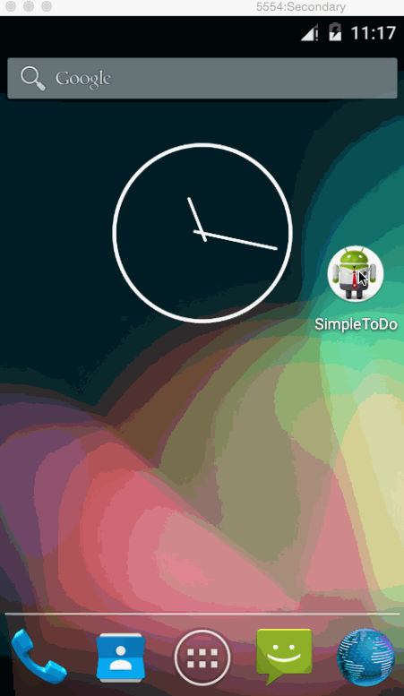
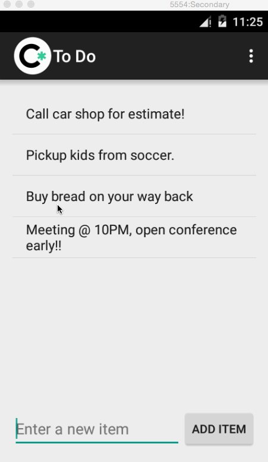
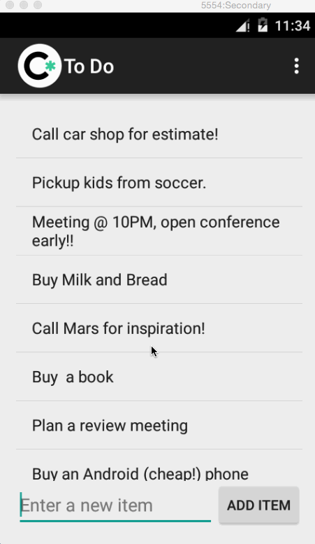
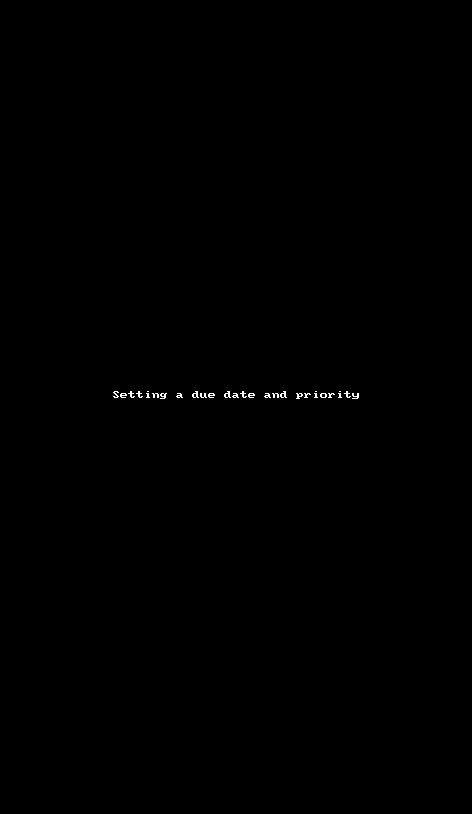
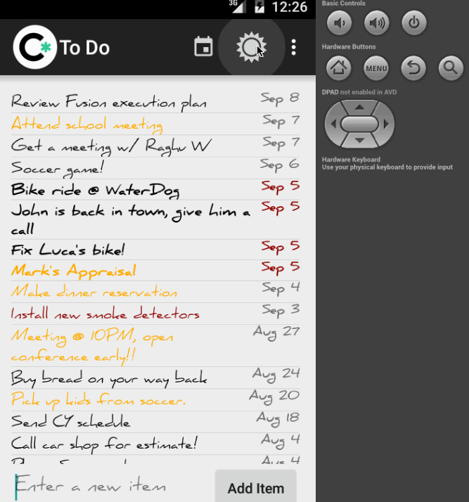
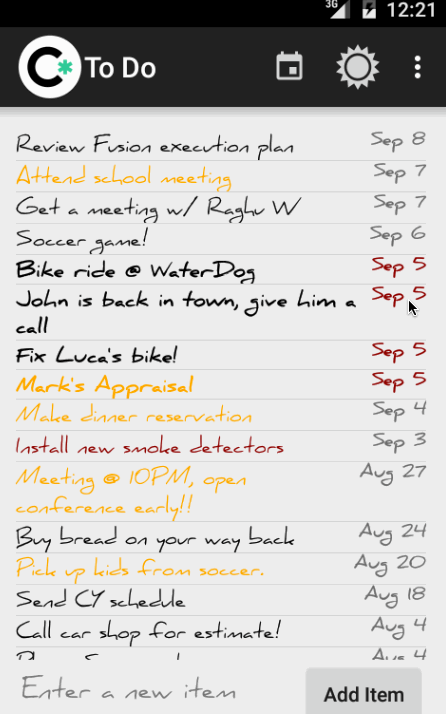
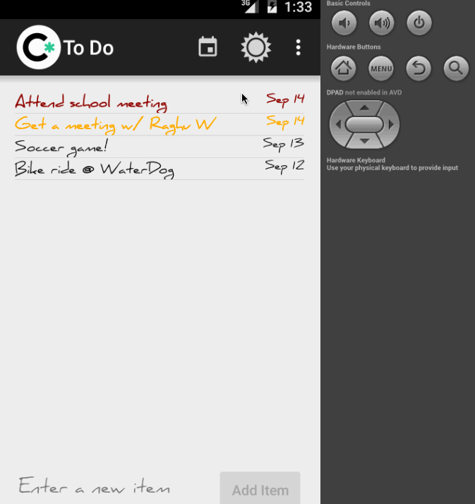
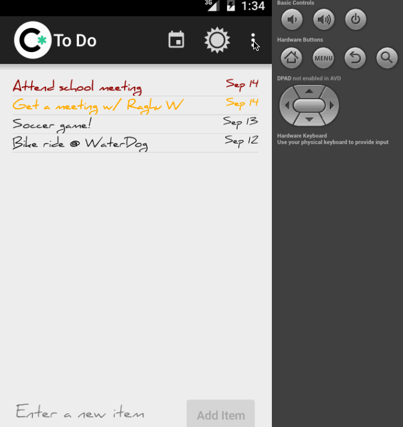

# Simple ToDo app (Android) - Pre-work

"Simple To Do" is an android app that allows building a todo list and basic todo items management functionality including adding new items, editing and deleting an existing item.

Submitted by: Alin Craciun

Time spent: 16 hours spent in total

## User Stories

The following required functionality is completed:

* [x] User can successfully add and remove items from the todo list
* [x] User can tap a todo item in the list and bring up an edit screen for the todo item and then have any changes to the text reflected in the todo list.
* [x] User can persist todo items and retrieve them properly on app restart

The following optional features are implemented:

* [x] Persist the todo items [into SQLite](http://guides.codepath.com/android/Persisting-Data-to-the-Device#sqlite) instead of a text file
* [x] Improve style of the todo items in the list [using a custom adapter](http://guides.codepath.com/android/Using-an-ArrayAdapter-with-ListView)
* [x] Add support for completion due dates for todo items (and display within listview item)
* [x] Use a [DialogFragment](http://guides.codepath.com/android/Using-DialogFragment) instead of new Activity for editing items
* [x] Add support for selecting the priority of each todo item (and display in listview item)
* [x] Tweak the style improving the UI / UX, play with colors, images or backgrounds

## Video Walkthrough 

Here's a walkthrough of implemented user stories:

* Adding items on the ToDo application

* Removing items from list - to remove an item press and hold the item to be removed (long click)

* Editing an item from list - to edit an item, scroll to desired item and tap.

* Setting a due date and priority. Tap the item you want to update. In the 'Edit Item' screen you can select a priority from the 3 options available. 'Life Matter' has the higest priority and is highlighted in red color. Lowest or standard priority items has black color and it's default when an item is added. You can set an item due date by taping the default due date and selecting a new date in the date picker window. You can scroll through the calendar months by swiping up and down. To change the year, tap the current year displayed in the calendar.
Item list is sorted by due date in descending order. Items with a due date on the current date have the date highlighted in red and bold style.

 

* Settings options allows you to filter out older items, delete them or start a fresh list by deleting everything. 

 

* An action bar item allows you to quickly view only the items that are due for current day. Click the calendar icon to enable the today filter, icon color will change to red. To disable the filter click the same calendar icon again. 

 

* In the application 'Settings' option user can change the item display font 

 

* In the application 'Settings' option user can change the priority names

 

GIF created with [LiceCap](http://www.cockos.com/licecap/).

## Notes

Logging was not consistent or I couldn't find the right way to ouput messages to the output console. Tried 'Log.d' and 'System.out.print' but messages didn't come through consistently.

## License

    Copyright 2015 Alin Craciun

    Licensed under the Apache License, Version 2.0 (the "License");
    you may not use this file except in compliance with the License.
    You may obtain a copy of the License at

        http://www.apache.org/licenses/LICENSE-2.0

    Unless required by applicable law or agreed to in writing, software
    distributed under the License is distributed on an "AS IS" BASIS,
    WITHOUT WARRANTIES OR CONDITIONS OF ANY KIND, either express or implied.
    See the License for the specific language governing permissions and
    limitations under the License.
